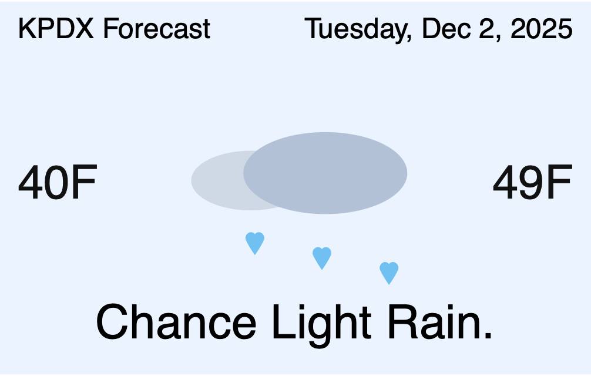

# Weather Report Card 📇🌤️

A small Node.js tool that generates a CR80-sized PDF forecast card for KPDX and can send it to a printer. 🖨️

Highlights
- Generates a single PDF named YYYYMMDD.pdf for the target date (e.g. 20251202.pdf). 📁
- Target date is computed from the current local time; override with CURRENT_DATETIME_OVERRIDE (ISO timestamp) for testing. ⏱️

Example

Quick start
1. Install dependencies: `npm install`
2. Generate a PDF: `npm start`
3. Override date for testing: `CURRENT_DATETIME_OVERRIDE=2025-12-02T03:21:20.571Z node index.js`

Printing
- System print: lp -d <PRINTER> -o media=CR80 -o fitplot 20251202.pdf will hand off fit-to-page to CUPS. 🖨️
- In-code IPP printing: the code uses the `ipp` module to call Print-Job; set PRINTER_NAME or update the IPP URI to target your printer if you want the script to print directly.

Files
- index.js — main script that fetches forecasts, renders SVGs, and writes the PDF.
- svgs/ — background SVG assets (named like sunny_cr80.svg, rainy_cr80.svg, etc.).
- example_20251202.png — sample generated card converted from 20251202.pdf (embedded below).

Example

Notes
- The generated PDF is placed in the repository root and named for the target local date in YYYYMMDD.pdf format. ✅
- If printing via IPP, check your printer's supported attributes (Get-Printer-Attributes) for supported scaling keywords (e.g. "auto-fit", "fit-to-page") and use those in the job attributes to emulate `-o fitplot` without calling lp. 🔧

Have fun! 🎉
